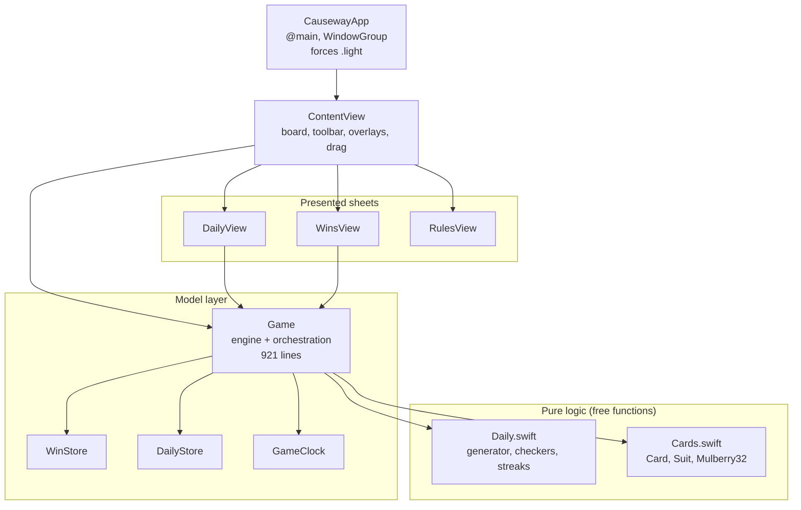
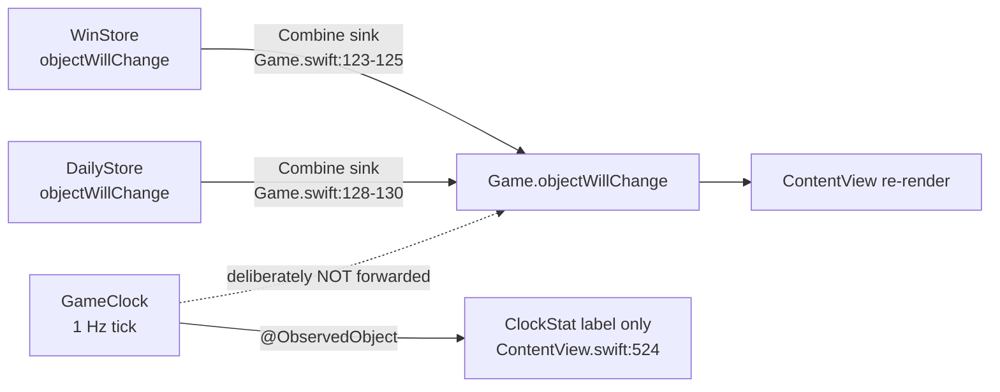
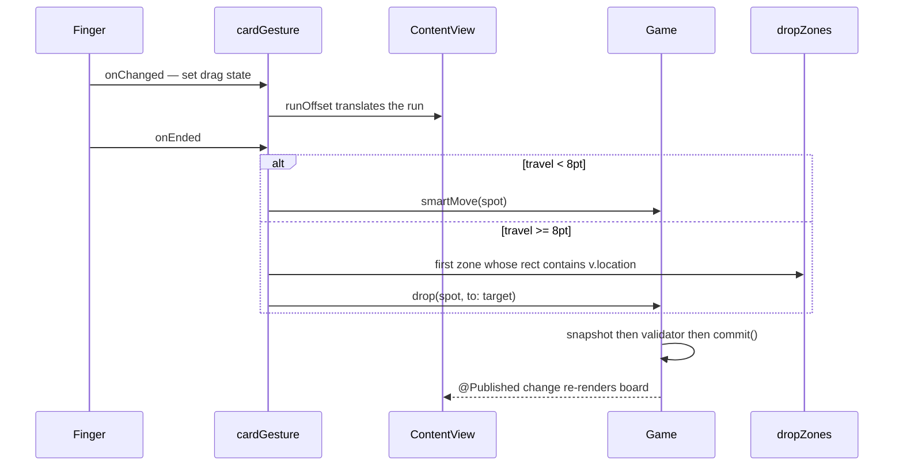
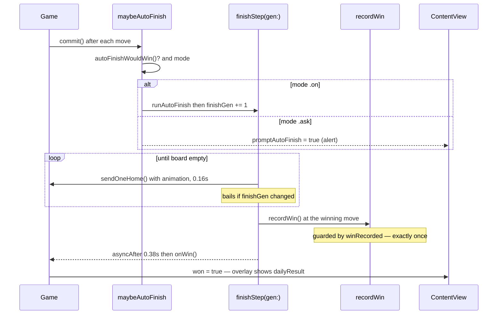
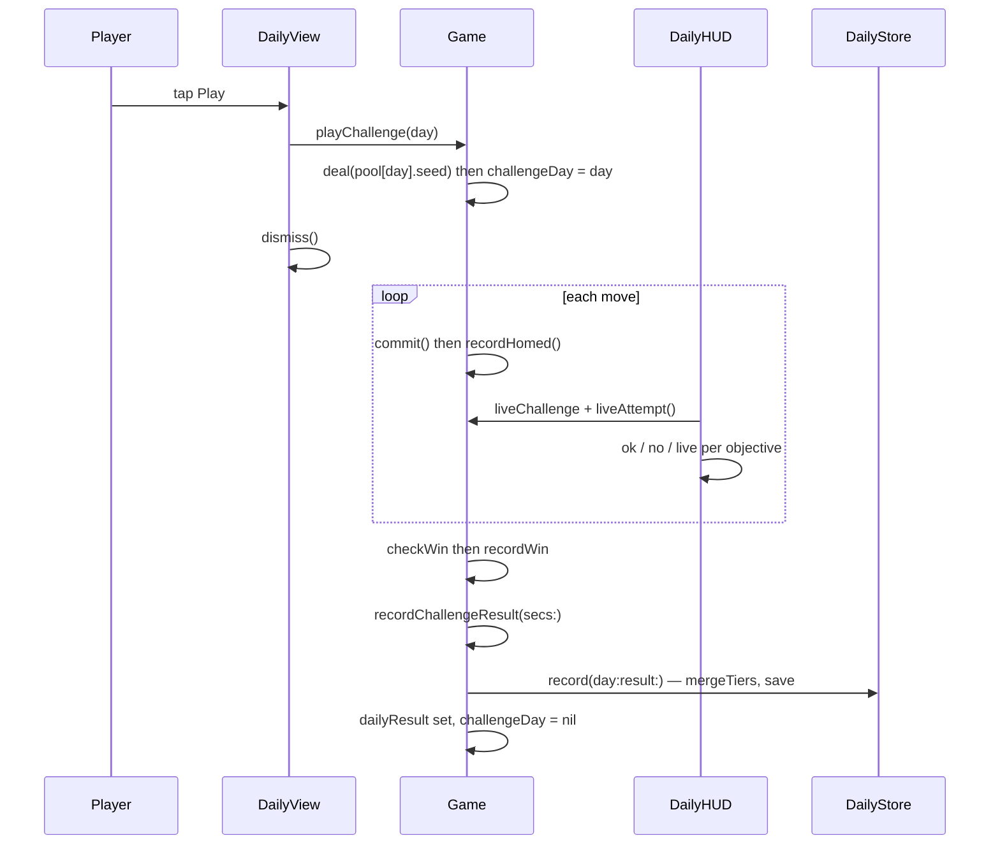
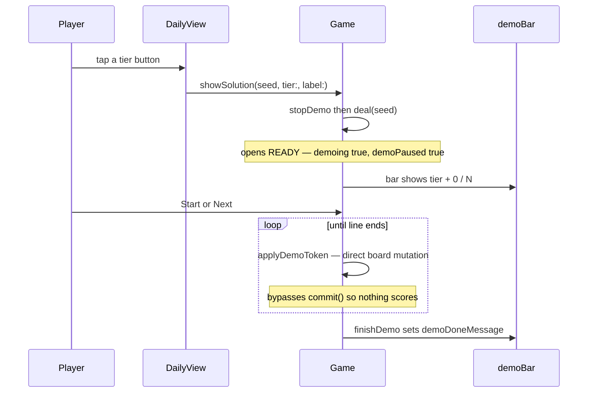
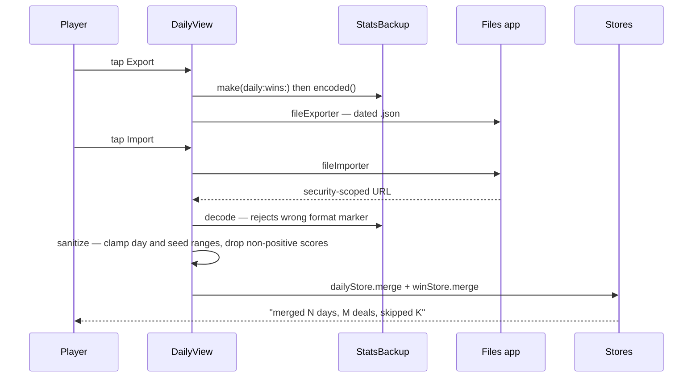
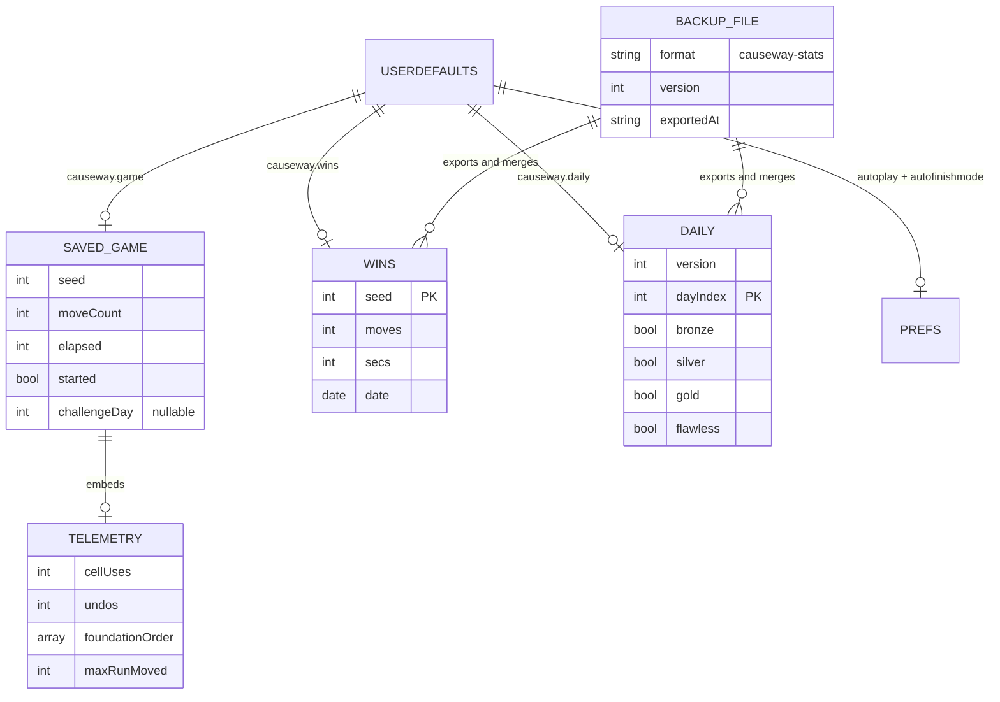

# Causeway — iOS App Architecture

The shipping product: a SwiftUI iPhone app at [`ios/Causeway/`](../../ios/Causeway/).
3 121 lines of Swift across 17 files, **zero third-party dependencies** (the Xcode target's
`Frameworks` and `Resources` build-phase file lists are both empty; everything is pulled in through
a filesystem-synchronized group).

| Setting | Value | Source |
|---|---|---|
| Deployment target | iOS **17.0** | `project.pbxproj:142, 170` |
| Bundle id | `com.whimsicaldistractions.Causeway` | `:199, 227` |
| Device family | **1** (iPhone only) | `:203, 231` |
| Orientations | Portrait + Landscape Left + Landscape Right | `:193, 221` |
| Swift version | **5.0** (no strict concurrency) | `:202, 230` |
| Version / build | 1.0 (1) | `:198/185` |
| Entitlements | **none** — no file, no `CODE_SIGN_ENTITLEMENTS` | grep |
| Targets | `Causeway` (app) + `CausewayUITests` (UI Testing Bundle) | no unit-test target |

Verified against source throughout; rationale not written in the repo is marked **(inference)**.

---

## 1. Top-level architecture

A conventional MV pattern for SwiftUI: one large `ObservableObject` engine owning three smaller
stores, observed by a view tree. There is no coordinator, router, or DI container — `ContentView`
owns the model via `@StateObject` and passes it down.

### Observation topology — the non-obvious part

SwiftUI does **not** propagate a nested `ObservableObject`'s changes through its parent. The app
handles this deliberately and asymmetrically, and that asymmetry is a performance fix, not an
oversight.

`GameClock` exists purely to break that link. Its doc comment (`Model/GameClock.swift:6-11`) is an
explicit post-mortem: `elapsed` used to be `@Published` on `Game`, so every second re-rendered the
entire board — including `SummerBackground`'s four `.blur()` layers and 52 cards carrying
`matchedGeometryEffect` — which was implicated in on-device memory growth and jetsam kills. The same
commit (`06cb6f5`) made `SummerBackground` `Equatable` with `static func == { true }`
(`Views/SummerBackground.swift:9`) and applies it as `.equatable()` (`ContentView.swift:78`) so
SwiftUI skips re-rasterising it entirely.

---

## 2. Module inventory

### 2.1 `CausewayApp.swift` (11 lines)

`@main` entry. One `WindowGroup { ContentView() }` with `.preferredColorScheme(.light)`
(`:8`) — the **only** dark-mode handling in the codebase, which is why every view hardcodes light
colours with no dark variant. No scene-level model injection.

### 2.2 `Model/Cards.swift` (43 lines)

- `enum Suit: Int` — `spade=0, heart, diamond, club`. Raw values are load-bearing (`Card.id`,
  and the opposite-colour lookup at `Game.swift:578`). `isRed`, `glyph`, `sfSymbol`.
- `struct Card: Identifiable, Equatable, Hashable, Codable` — `suit`, `rank` (1…13),
  `id = suit.rawValue * 13 + rank` (`:20`), `rankLabel`.
- `struct Mulberry32` — `init(UInt32)`, `mutating next() -> Double`, `mutating int(_ bound) -> Int`.
  A faithful transcription of the JS PRNG using `&+`/`&*` so UInt32 wraparound matches
  `Math.imul`/`|0` semantics (`:35-38`). Pinned by `tests/ios-parity.test.mjs:31-36`.

### 2.3 `Model/Game.swift` (921 lines) — the engine

The single largest file and the orchestration hub. Public surface, grouped:

| Area | Members |
|---|---|
| Board state | `@Published tableau, cells, up, down, selection, seed, moveCount, won` |
| Preferences | `@Published autoplayOn`, `@Published autoFinishMode` (both persist in `didSet`) |
| Dealing | `deal(seed:)`, `newRandomGame()`, `restartDeal()`, `randomSeed()`, `nextSeed` |
| Rules | `isSeqHead(col:idx:)`, `canFoundationUp/Down(_:)` |
| Intents | `smartMove(_:)`, `drop(_:to:)`, `undo()`, `canUndo` |
| Auto | `runAutoplay()`, `runAutoFinish()`, `maybeAutoFinish()`, `deferAutoFinish()`, `cycleAutoFinishMode()`, `canOfferFinish`, `@Published finishing`, `@Published promptAutoFinish` |
| Persistence | `persist()`, private `restore()`, private `clearSaved()` |
| Daily | `pool`, `@Published challengeDay`, `@Published dailyResult`, `playChallenge(_:)`, `liveChallenge`, `liveAttempt()` |
| Demo | `showSolution(_:tier:label:)`, `demoTogglePause()`, `demoStepOnce()`, `stopDemo()`, `@Published demoing/demoPaused/demoStarted/demoDoneMessage/demoTier/demoLabel`, `demoProgress` |
| Owned stores | `winStore`, `dailyStore`, `clock` |

**Three mechanisms worth calling out.**

*Commit funnel.* `commit()` (`:396-405`) is the exact analogue of the web's `commitMove`: bump
`moveCount`, `recordHomed()`, start the clock on first move, clear selection, win-check, persist,
maybe auto-finish, resume autoplay.

*Generation tokens for async cancellation.* `finishGen` and `demoGen` (`:70`, `:103`) are monotonic
counters bumped on every teardown/restart. Each `DispatchQueue.main.asyncAfter` block captures the
value at schedule time and bails if it no longer matches (`:665`, `:678`, `:835`). This replaces the
web's three ad-hoc timer handles and is the mechanism that makes undo-during-finish and
stop-during-demo safe.

*Idempotent durable win.* `recordWin()` (`:746-755`) is guarded by `winRecorded` and called both at
the winning move and again from `onWin()` after the deferred beat. That `guard !winRecorded else
{ return }` line is important enough to be drift-pinned from the Node suite
(`tests/ios-parity.test.mjs:74-76`).

*Selection as staging.* `drop(_:to:)` (`:457-469`) assigns `selection`, calls a `tryMoveTo*`
validator, then clears it — the same vestigial shape as the web build, kept so the tap-era validators
could be reused verbatim.

### 2.4 `Model/Daily.swift` (421 lines) — daily logic, ported

A line-for-line Swift mirror of canonical `tests/daily.mjs`. Contents:

- **Calendar**: `floorDiv`/`floorMod` (`:16-23`) exist because Swift's `/` and `%` truncate toward
  zero while the JS reference uses `Math.floor`; they diverge only for negative numerators, but the
  port matches `Math.floor` for all inputs so the reference is honoured. `daysFromCivil`,
  `EPOCH_DAYS = daysFromCivil(2026,8,12)`, `dayIndexFor`, `todayIndex()`.
- **Telemetry types**: `FoundationEvent`, `Telemetry` (with a defensive `init(from:)`), `Attempt`.
- **Checkers**: `acesFirst`, `kingsFirst`, `jacksDownFirst`, `suitsTopDown`, `suitSprint`,
  `downOpeners20` and the `objectiveCheck(_:_:param:)` dispatcher (`:83-149`).
- **Frozen pools** (`:161-163`) — marked `FROZEN — APPEND-ONLY, NEVER REORDER` because the per-day
  RNG indexes them.
- **Generator** `dailyChallenge(_:_:)` (`:202-216`). One deliberate divergence from web: empty
  silver/gold pools return `nil` rather than crashing on a subscript (`:208-210`) — the comment notes
  web yields `undefined` and merely misrenders, whereas Swift would trap.
- **Grading**: `TierResult` (tolerant `init(from:)`; five booleans — bronze/silver/gold/flawless plus
  ⏰ `onTime`), `evaluateChallenge(_:_:onTime:)`, `isOnTime(challengeDay:winDay:attemptStartDay:)`,
  `mergeTiers`, `streaks` returning five `StreakRun {current, best, total}`s.
- **UI-only hints**: `objViolated(_:_:)` and `objSecured(_:_:up:down:)` (`:312-383`) — the same
  unguarded fourth copy of objective semantics that exists on web.
- **`enum DailyData`** (`:403-421`) — `static let pool` and `static let solutions`, lazily decoded
  from the bundled JSON, defaulting to empty on any failure so the feature simply disables itself.

### 2.5 Stores

**`Model/WinStore.swift`** (103 lines) — `@Published private(set) wins: [Int: WinRecord]`,
key `causeway.wins`, plus `ranges()` which compresses solved seeds into contiguous
`ClosedRange<Int>` runs for the Wins screen, and `merge(_:)` for backup import. Persisted as a flat
`[String: WinRecord]` JSON object with **no version wrapper**.

**`Model/DailyStore.swift`** (67 lines) — `@Published private(set) days: [Int: TierResult]`,
key `causeway.daily`, persisted as `{version, days}` (**v3** since the 2026-08-30 rebuild; a pre-v3
blob is stashed under `causeway.daily.v<n>` and the store starts clean). `record(day:result:)` OR-accumulates through
`mergeTiers` so an earned badge can never be lost.

Both use the same corruption strategy: on decode failure, write the raw blob to
`<key>.unreadable` and return without clearing in-memory state (`WinStore.swift:76-81`,
`DailyStore.swift:43`).

**`Model/GameClock.swift`** (29 lines) — isolated timer, `start/stop/reset/set`, `[weak self]`,
`deinit` invalidate. See §1 for why it exists.

**`Model/StatsBackup.swift`** (41 lines) — the portable export format:
`{format: "causeway-stats", version, exportedAt, daily, wins}`, encoded `.prettyPrinted, .sortedKeys`.
`decode` validates the `format` marker. Range/sanity validation deliberately lives in the *view*
(`DailyView.swift:236-248`), not here.

**`Model/MemoryMonitor.swift`** (61 lines) — houses `enum DebugFlags { static let memoryHUD = false }`
(`:9-11`), a mach `task_info`/`phys_footprint` reader, and a 0.5 Hz sampling observable. The flag is
deliberately *not* `#if DEBUG`-gated so the HUD can be read in an untethered Release build, since
Xcode's own instrumentation inflates memory (`:4-8`).

### 2.6 Views

| View | File | Role |
|---|---|---|
| `ContentView` | `Views/ContentView.swift` (534) | board, portrait deck / landscape rail, drag system, demo bar, win overlay, sheet hosting |
| `DailyHUD` | same file (`:361`) | live objectives chips over the board |
| `ClockStat` | same file (`:524`) | the isolated time label |
| `CardView`, `SlotView` | `Views/CardView.swift` (105) | stateless card face and empty slot; **width is the only sizing input** |
| `DailyView` | `Views/DailyView.swift` (407) | Challenges screen: streaks, day card, calendar, backup section |
| `WinsView` | `Views/WinsView.swift` (96) | deal entry, range chips, drill-down |
| `RulesView` | `Views/Extras.swift` | How-to-play + About (the wrapping-toolbar `FlowLayout` went with the 2026-09-13 controls redesign) |
| `SummerBackground` | `Views/SummerBackground.swift` (127) | the vector scene; `Equatable` for render skipping |
| `MemoryHUD` | `Views/MemoryHUD.swift` (35) | debug overlay, unreachable while the flag is false |
| `Theme` | `Theme.swift` (43) | palette, `Color(hex:)`, `cardAspect = (92/66)*1.2 ≈ 1.673` |

### 2.7 Layout strategy

`ContentView.body` computes card size from `GeometryReader` before building anything
(`:43-75`), then branches:

- **Portrait** — `header (title · deal chip · stats) → HUD/demo bar → upperArea (foundations left,
  free cells right) → tableau → deck` (2026-09-13, Option A2 of
  [`docs/portrait-controls-proposal.md`](../portrait-controls-proposal.md)): the controls sit at
  the FOOT of the screen — a Finish pill while the board is finishable, a permanent tier with the
  two auto settings, and a bottom bar with New game · Undo · Replay · Daily · More (Wins, How to
  play). Card width is simply `(width - padding - gaps) / 8`; the board self-fits between the
  header and the deck.
- **Landscape** — three side-by-side columns: a scrolling controls **rail** (the deck's actions as
  one column, same ids, same vocabulary — icons, state badges, More; Finish docks at its foot), then
  foundations-with-free-cells-beneath, then the tableau. Card width is
  `min(widthBound, heightBound)` where the width bound counts 12 card-widths
  (4 foundation + 8 tableau) and the height bound sizes to the current tallest column with a floor of
  8 (`:62-73`).

The rail is the only `ScrollView` in the board area, and the comment explains why the others are not:
a `ScrollView` would fight the cards' `minimumDistance: 0` drag gesture; the rail holds no cards, so
it is safe (`:50-51`, `:150-152`). Landscape card sizing tracks the live tallest column, so cards
gently shrink rather than clipping when a column grows past 8.

### 2.8 The drag system

Manual, not `.draggable`. Commit `62be89c` replaced the native drag-and-drop because press-and-hold
plus the system copy badge felt wrong; the memory of that decision is preserved in `BACKLOG.md`.

Three cooperating pieces:

1. **`cardGesture(for:canDrag:)`** (`:279-301`) — one `DragGesture(minimumDistance: 0)` per card.
   Travel under `tapSlop = 8` on release is a tap (`smartMove`); more is a drop. A guard ignores a
   second finger's release while another card owns the drag.
2. **`DropZonesKey: PreferenceKey`** (`:14-19`) — every drop target renders a transparent
   `dropZone(_:)` probe (`:304-309`) reporting its frame in the named `"board"` coordinate space;
   `ContentView` collects them via `.onPreferenceChange` (`:117`). On release, hit-testing is a
   linear scan for the frame containing the finger (`:295`).
3. **`runOffset(_:)`** (`:264-274`) — translates the dragged card *and everything stacked below it*,
   so a run moves as one.

A self-heal exists at `:123-130`: if an async auto-play removes the dragged card mid-gesture, its
view (and gesture) vanish and `onEnded` never fires, so a `moveCount` observer clears the stuck drag
— but only when the source no longer holds its card, so a legitimate in-flight drag is never
cancelled.

### 2.9 Resources

`daily-pool.json` and `daily-solutions.json` are byte-identical copies of `data/` (SHA-256 verified),
bundled automatically by the synchronized group. `LaunchScreen.storyboard` is a single empty view.
`PrivacyInfo.xcprivacy` declares no tracking, no collected data, and `CA92.1` for `UserDefaults`.
`Assets.xcassets` contains `AccentColor.colorset` and a single bundled image —
`AppIcon.appiconset/AppIcon-1024.png`, itself generated by the script below. Every visual *inside*
the app (background, cards, court figures, pips) is drawn in code or from SF Symbols, so there are
no other image assets.
`ios/tools/make_icon.swift` is a standalone macOS script (not in the target) that renders the
1024² icon and flattens alpha, which App Store Connect requires.

---

## 3. Key flows

### 3.1 Tap and drag

### 3.2 Auto-finish and the deferred win overlay

The 0.38 s delay lets the final card land before the overlay covers the board; recording durably
*before* the delay means a process kill during the beat cannot lose the win. `runAutoFinish` guards
on `!checkWin()` (`:655`) so re-entering during that window cannot bump `finishGen` and orphan the
pending win.

### 3.3 Daily challenge: play, score, persist

The HUD's `liveState` (`DailyView.swift:378-385`) resolves in three steps: if won, run the real
checker; else if `objViolated`, show ✗; else if `objSecured`, show a green ✓ ("on track"); otherwise
neutral. Budget objectives (moves/undo/cells) are never "secured" pre-win because they can still be
blown.

### 3.4 "Show me how to win" demo

Input is locked while `demoing` (`smartMove` and `drop` both early-return, `:458`, `:522`), and
`persist()` refuses to save a mid-demo board (`:226`) so a relaunch cannot resume an auto-played
line.

### 3.5 Stats export and import

Import is **additive only** — both `merge` implementations OR the tier flags and keep the better
score, so an import can add or improve but never delete or downgrade. The sanitisation pass
(`DailyView.swift:236-248`) exists because a hand-edited file could otherwise inject phantom day
indices or a bogus `moves: 0` "best".

---

## 4. Persisted data model

**Complete `UserDefaults` key inventory** (no `@AppStorage` anywhere; all access is direct):

| Key | Type | Owner | Read at |
|---|---|---|---|
| `causeway.autoplay` | Bool | `Game` | `init` |
| `causeway.autofinishmode` | String | `Game` | `init` |
| `causeway.game` | Data (JSON) | `Game` | `restore()` |
| `causeway.wins` | Data (JSON) | `WinStore` | `load()` |
| `causeway.daily` | Data (JSON) | `DailyStore` | `load()` |
| `causeway.wins.unreadable` | Data | `WinStore` | **never** |
| `causeway.daily.unreadable` | Data | `DailyStore` | **never** |

`restore()` (`Game.swift:237-282`) mirrors the web's validation exactly: shape checks, per-suit
`up < down` range checks, all 52 canonical card ids present exactly once (counting cards implied home
by the foundation ranks), and rejection of a completed board.

---

## 5. State of the architecture — iOS app

### Design decisions and their apparent rationale

| Decision | Evidence | Rationale |
|---|---|---|
| Port the engine to Swift rather than embed JS | `Model/Game.swift`, `Model/Daily.swift` | native performance and type safety; the cost is triplicated logic, mitigated by drift guards |
| `GameClock` isolated from `Game` | `Model/GameClock.swift:6-11` | documented memory post-mortem — the 1 Hz tick was re-rendering blurred layers and 52 matched-geometry cards |
| `SummerBackground: Equatable` returning `true` | `Views/SummerBackground.swift:9` | same fix; the view has no inputs so re-evaluation is pure waste |
| Manual `DragGesture` over `.draggable` | commit `62be89c`, BACKLOG | native drag required press-and-hold and showed system copy chrome; felt wrong for cards |
| Drop targets via `PreferenceKey` in a named space | `ContentView.swift:14-19, 304-309` | keeps hit-testing layout-agnostic — the landscape redesign changed containers without touching drag code |
| Generation tokens for async work | `finishGen`, `demoGen` | makes every queued `asyncAfter` self-invalidating; replaces the web's manual timer bookkeeping |
| `recordWin` durable and idempotent | `Game.swift:746-755` | a kill during the deferred-overlay beat must not lose the win |
| `deal()` as demo-teardown chokepoint | `Game.swift:147-154` | a queued demo step against a new board would trap on `removeLast()` |
| Daily data as bundled JSON | `Model/Daily.swift:403-421` | no network; also guarantees byte-identical parity with web |
| Backup sanitisation in the view | `Views/DailyView.swift:236-248` | added after review found a hand-edited file could inject phantom entries |

### Tight coupling and accumulated debt

1. **`Game` is a 921-line god object.** It owns board state, rules, input intents, two automation
   state machines, the demo player, persistence, daily scoring, and store coordination. Its
   `@Published` surface is ~15 properties, so any change invalidates every view observing `game` —
   which is `ContentView`, `WinsView` and `DailyView` in their entirety. `GameClock` was carved out
   for exactly this reason; nothing else has been.
2. **Native coverage is UI-level only.** A `CausewayUITests` UI Testing Bundle now exists and
   runs (6 tests, incl. 4 regression guards for demo-never-scores, portrait tall columns, the
   calendar weekday header, and disabled-pill legibility). There is still **no unit-test target**
   exercising the model layer directly. Backlog **F6** records the original reason (editing the hand-authored
   `project.pbxproj` without Xcode was judged risky). Consequently the async timing paths —
   auto-finish, deferred win, demo stepping — have **zero** automated coverage, and the backlog
   (**AF-test**) notes this area has already produced one blocker and one major that the Node suite
   structurally cannot see.
3. **Corruption "recovery" is write-only.** Both stores quarantine an unreadable blob to
   `<key>.unreadable`, but `grep` proves nothing ever reads those keys back. Worse, the failure path
   does not `save()`, so the bad blob stays under the primary key until the next win silently
   overwrites it. Backlog **O2** records this and adds the real risk: `WinRecord` has no schema
   version, so any future non-optional field routes every user's history into the dead-end key.
4. **`DailyStore.version` is written but never validated** — `load()` reads `decoded.days` and
   ignores `decoded.version` (`:38-49`). Forward compatibility actually comes from `TierResult`'s
   hand-written tolerant `init(from:)`. Similarly `StatsBackup.version` is checked nowhere and
   `exportedAt` is never read.
5. **Nondeterministic duplicate-key resolution.** `DailyStore.load()` merges duplicate int keys with
   `{ a, _ in a }` (`:48`) — Swift dictionary iteration order is unspecified, so `"1"` vs `"01"`
   resolves arbitrarily. `WinStore` uses a deterministic min-secs rule (`:85`). Only reachable via
   hand-edited data, but the two stores disagree.
6. **`GameClock` uses `.default` run-loop mode.** `Timer.scheduledTimer` without adding to
   `.common` means the clock stops ticking during UIKit tracking (e.g. scrolling the Wins sheet), so
   `elapsed` under-counts wall time. Combined with the tick-count model, this is backlog **L4** —
   iOS time and web time are different quantities.
7. **`FlowLayout` measures and places against different widths** — `sizeThatFits` wraps against
   `proposal.width`, `placeSubviews` against `bounds.width` (`Views/Extras.swift:8-33`). If SwiftUI
   proposes a width that differs from the final bounds, row breaks can disagree between passes.
   Latent, not currently observed.
8. **Accessibility is absent.** Backlog **M7**: no VoiceOver labels or actions, all type is fixed
   `.system(size:)` so Dynamic Type is ignored, and cards are tap-gesture views rather than buttons.
9. **Known scoring quirk.** `WinStore.merge` and `record` take `min(moves)` and `min(secs)`
   independently (`:26-28`, `:42-44`), so a stored "best" can describe a playthrough that never
   happened — backlog **L5**, shared with web.

### Inconsistencies with the web prototype

| Area | iOS | Web |
|---|---|---|
| Time source | tick-count (`elapsed += 1`), stalls in tracking mode | wall clock from `Date.now()` |
| Empty objective pool | returns `nil` (would otherwise trap) | yields `undefined` and misrenders |
| Async cancellation | generation tokens | three manual timer handles |
| Landscape | dedicated three-column layout with a scrolling rail | none |
| Stats backup | export/import + sanitisation | absent |
| Daily availability | always (bundled) | needs a served origin |
| Deal-number entry hint | `"Number 1–1000000"` unformatted (`WinsView.swift:48`) | `"1–1,000,000"` formatted |

### Vestigial code (each grep-verified to have no callers)

| Item | Location | Evidence |
|---|---|---|
| `Theme.cardCream`, `Theme.cardCreamTop` | `Theme.swift:18-19` | no references; `CardView.swift:14` fills with `Color.white` |
| `Theme.cardTintBottom(_:)` | `Theme.swift:35-42` | no references — per-suit tint was removed from the card design |
| `Theme.background` | `Theme.swift:27-30` | no references; superseded by `SummerBackground` |
| `Suit.glyph` | `Cards.swift:8` | no references; pips are drawn from `sfSymbol` |
| `MemoryMonitor.stop()` | `MemoryMonitor.swift:50` | no callers — `MemoryHUD` starts the monitor in `.onAppear` with no `.onDisappear` |
| `causeway.*.unreadable` / `causeway.daily.v1` keys | `WinStore.swift`, `DailyStore.swift` | written, never read — deliberate: they stash a store the app could not use rather than destroying it |
| `MemoryHUD` + `MemoryMonitor` + `MemoryFootprint` | 3 files, ~78 lines | unreachable while `DebugFlags.memoryHUD == false`; intentionally retained per `MemoryMonitor.swift:4-8` |
| Unused baked pool fields | `daily-pool.json` | `PoolDay` decodes only `seed`, `par`, `silver`, `gold` — `version`, `epoch`, `minSeed`, `maxSeed` are never read |

One more artefact of drift rather than dead code: **`LaunchScreen.storyboard` is the wrong colour.**
Its background is `#687D78` (`:15`), which sits between the first two stops of the *unused*
`Theme.background` forest gradient. The app's actual background is `SummerBackground`, whose top stop
is `0xFFD777` (warm yellow). The launch screen was matched to a background that no longer ships, so
launch flashes grey-green before a summer sky.

### Documentation drift — repaired 2026-08-15

`ios/README.md` had drifted badly: it stated the target was "iPhone-only, **portrait**" (landscape
shipped at `ea5f8d2`/`9186185`), described the controls as "smart double-tap" (replaced by
tap/drag at `f334972`), listed a project layout predating the entire daily-challenge feature and the
memory work, and documented two `UserDefaults` keys where five live ones exist. It has been brought
up to date, including the stats-backup feature and the absent-accessibility caveat (**M7**).

Worth noting for future edits: the README's "no networking" claim was *technically* imprecise —
the app does handle local `file://` URLs from the document picker for stats backup. The claim is now
worded to say exactly that, since the privacy posture (nothing leaves the device unless the user
exports it themselves) is the part that actually matters.
