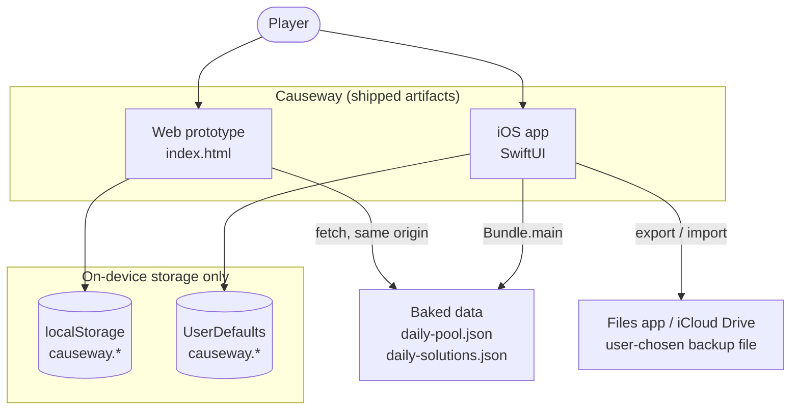
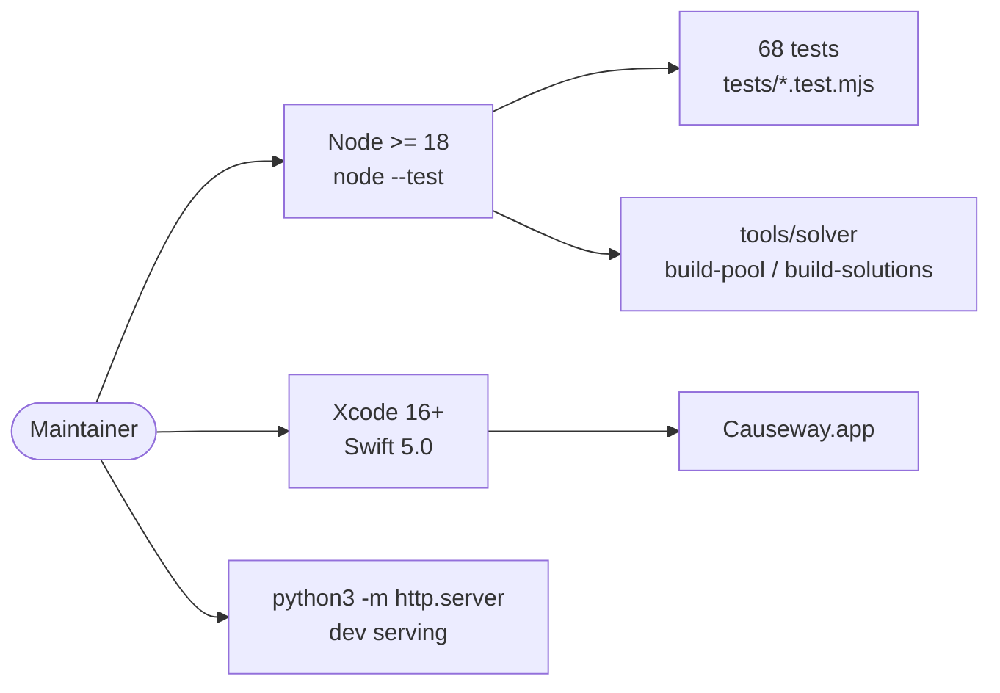
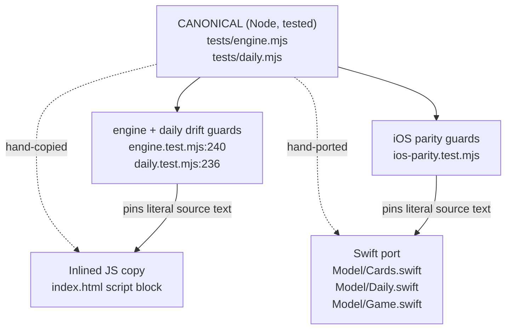
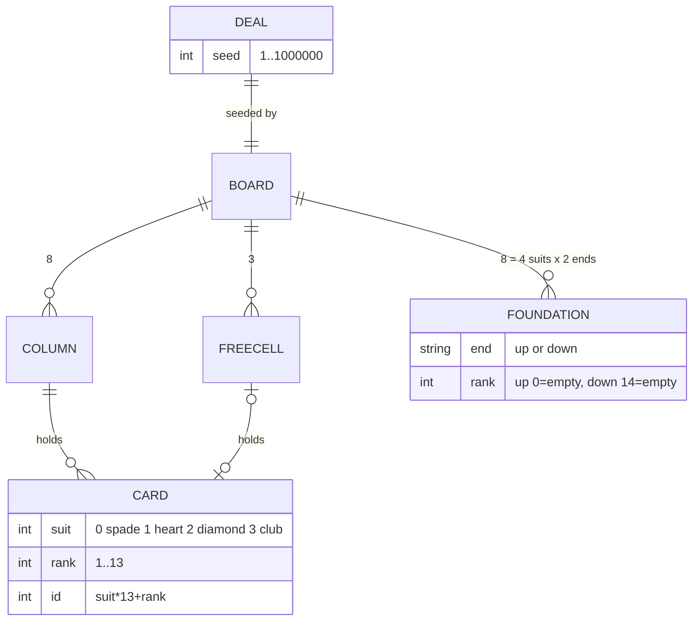
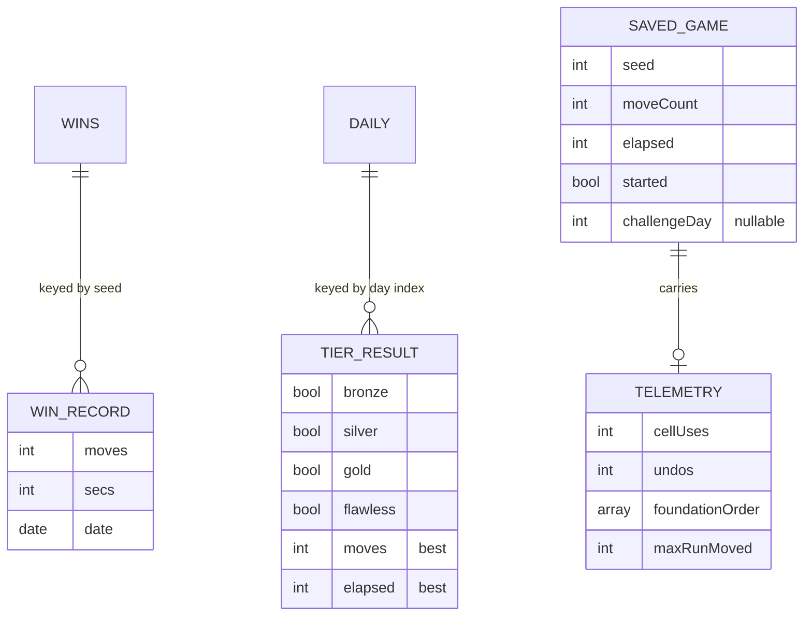
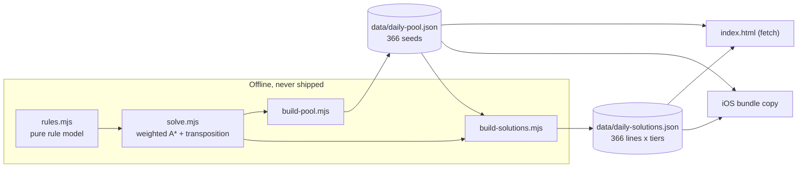

# Causeway — Architecture Overview

**Scope.** This document covers the whole system: the web prototype (`index.html`), the native
iOS app (`ios/`), and the shared build-time and test infrastructure that binds them. Detailed
per-codebase documents:

- [`web-prototype.md`](web-prototype.md) — the single-file browser build
- [`app.md`](app.md) — the SwiftUI iOS app

**Accuracy convention.** Every structural claim below is verified against source and cited with a
file path (and line where useful). Statements about *intent* or *rationale* that are not written
down in the repo are explicitly marked **(inference)**.

---

## 1. What the system is

Causeway is an original full-information skill solitaire. Its distinguishing mechanic: **each suit
is built from both ends**. Every suit owns two foundations — an *up* pile (A, 2, 3 …) and a *down*
pile (K, Q, J …) — which close toward each other and must never cross. The player chooses where
each suit splits ([`README.md`](../../README.md), rules text at `index.html:333-337`).

Structurally the game is FreeCell-adjacent: 52 cards face up, 8 tableau columns dealt 7/7/7/7/6/6/6/6,
3 free cells, alternating-colour tableau runs, supermoves sized by free cells and empty columns, safe
auto-play, and reproducible numbered deals (`tests/engine.mjs:34-51`).

Two products are built from that one game:

| | Web prototype | iOS app |
|---|---|---|
| Artifact | `index.html` (1 627 lines, self-contained) | `Causeway.app` (SwiftUI, ~2 800 lines Swift) |
| Runs from | a browser, incl. `file://` | iPhone, iOS 17.0+ |
| Storage | `localStorage` | `UserDefaults` |
| Role | design/rules reference and playable prototype | the shipping product |

The web build came first (`a875b22`, 2026-06-19); the iOS port arrived at `5f2253d` and the two have
been developed in lockstep since — most feature commits touch both (`1132c8c`, `234d989`, `767e30a`).

---

## 2. System context

The most notable architectural fact about Causeway is what is *absent*. There is no backend, no
account system, no analytics, no third-party SDK, and no runtime dependency the user must trust.



**No external services participate at runtime.** Verified: `index.html` issues exactly two
`fetch()` calls, both for its own static assets on the same origin (`index.html:1215`, `1219`); the
iOS app contains no `URLSession` and no network entitlement, and its only `URL` use is the
security-scoped document picker for stats backup (`ios/Causeway/Causeway/Views/DailyView.swift:227`).
The app declares `NSPrivacyTracking false`, zero collected data types, and a single accessed-API
reason `CA92.1` for `UserDefaults` (`ios/Causeway/Causeway/PrivacyInfo.xcprivacy`). No entitlements
file exists in the project at all.

### Development-time dependencies



`package.json` has **zero** dependencies and devDependencies and exactly one script:
`node --test "tests/**/*.test.mjs"`. The solver tools are run by hand, not via npm
(`docs/solver.md:143-146`). The dev server config lives at `.claude/launch.json` (port 8123).

---

## 3. How the two codebases relate

They do **not** share code. They share *logic*, maintained as three hand-written copies of the same
algorithms, held together by text-matching drift guards in CI.



**Why three copies rather than one shared module** — the reason is documented at
`tests/engine.mjs:3-7` and `tests/daily.mjs:2-4`: `index.html` is deliberately a dependency-free
single file that must run from `file://`, so it cannot `import`. Swift cannot consume the JS at all.
The canonical modules therefore live under `tests/` (they are *modules that happen to be tested*,
not test helpers), and each product carries its own transcription.

**How drift is prevented.** Guards are whitespace-normalised substring assertions — each pins the
*literal body* of a parity-critical function so that editing one copy without the others fails CI:

| Guard | File | Pins |
|---|---|---|
| engine ↔ web | `tests/engine.test.mjs:240-268` | mulberry32 body, deck build, Fisher–Yates, 7/7/7/7/6/6/6/6 layout, `isSafeAutoplay`, save validation, `autoFinishWouldWin`, `sendOneHome` |
| rules ↔ web | `tests/solver.test.mjs:24-47` | `isSeqHead`, `runDir`, `tailDir`, `canStackTableau` no-reverse rules, `maxMovable`, foundation predicates |
| daily ↔ web | `tests/daily.test.mjs:236-258` | all six ordering checkers, the frozen per-day RNG seed, silver/gold pool construction and pick order, epoch constant, `mergeTiers`, streak walk |
| canonical ↔ Swift | `tests/ios-parity.test.mjs` | Swift mulberry32 wrapping arithmetic, deal layout, floor-division calendar, frozen objective arrays, generator seed, all six checkers, `mergeTiers`/streaks, `guard !winRecorded`, `applyDemoToken` — plus a cross-check that the web and iOS token appliers agree |

These pins were introduced as a substitute for a native test target: `tests/ios-parity.test.mjs:1-9`
and `tests/README.md` state that adding one to the hand-authored `project.pbxproj` was judged too
risky. A `CausewayUITests` UI Testing Bundle target has since been added (2026-08-21) and runs, but
it exercises the app through the UI — the drift guards remain the only thing pinning the Swift
*logic* to the canonical modules, so they are still load-bearing. A model-level unit-test target
remains open as backlog **F6**.

---

## 4. Shared domain model

The same conceptual entities exist on both platforms, under different type systems.



Load-bearing details, verified identical on both platforms:

- **Suit numbering** `0=♠ 1=♥ 2=♦ 3=♣` and **card id** `suit*13 + rank` (`tests/engine.mjs:26-30`,
  `ios/Causeway/Causeway/Model/Cards.swift:20`). The id doubles as the SwiftUI
  `matchedGeometryEffect` identity and as the duplicate-detection key in save validation.
- **Foundation encoding** `up[suit]` = highest rank placed, `0` when empty; `down[suit]` = lowest
  rank placed, `14` when empty. A suit is complete when `down == up + 1`
  (`index.html:488-489, 634`; `Model/Game.swift:44-45, 354`).
- **Deal reproducibility** — `mulberry32(seed)` + descending Fisher–Yates + the 7/7/7/7/6/6/6/6
  layout. Deal *N* is byte-identical on both platforms; golden id-orders for seeds 1, 42 and 999999
  are pinned at `tests/engine.test.mjs:20-24`.

### Persisted state (conceptual, per platform)



Storage keys are deliberately identical in name across platforms (`causeway.wins`,
`causeway.daily`, `causeway.game`, `causeway.autoplay`, `causeway.autofinishmode`) even though the
backing stores differ — see each detail doc for exact shapes.

---

## 5. Daily Challenges — the one cross-cutting feature

This is the largest subsystem and the main reason the shared-logic problem matters. Design:
[`docs/daily-challenges.md`](../daily-challenges.md).

**Model.** One featured deal per calendar day, with three graded tiers on that single deal: 🥉 Bronze
(clear the deal — required, keeps the streak), 🥈 Silver and 🥇 Gold (one objective each, optional).
A fourth derived tier, 🌟 **Flawless**, means all three earned in a *single* attempt
(`tests/daily.mjs:97-105`).

**Determinism.** `dailyChallenge(dayIndex, pool)` is a pure function. Day index = days since the
frozen epoch **2026-08-12** (`tests/daily.mjs:19`). Day *D* always maps to `pool.seeds[D]`, and a
per-day RNG seeded `mulberry32((0x9e3779b9 ^ (dayIndex+1)) >>> 0)` draws Silver then Gold from what
that seed is certified to support (`tests/daily.mjs:72-83`). The pool is **append-only** so history
can never be rewritten — appending seeds cannot shift a past day, which is asserted directly at
`tests/daily.test.mjs:48-52`.

**Objective catalogue** — 17 implemented ids (`tests/daily.mjs`):

| Grade | id | Requires (in addition to winning) |
|---|---|---|
| Silver (universal) | `moves` | `moves <= round(par * 1.2)` |
| Silver (universal) | `no-undo` | `undos == 0` |
| Silver (certified) | `cells-le-1` / `cells-le-2` | `cellUses <= 1` / `<= 2` |
| Silver (certified) | `down-openers-20` | 4th King reaches a down foundation by move 20 |
| Gold | `no-cells` | `cellUses == 0` |
| Gold | `aces-first` | first four foundation sends are all Aces |
| Gold | `kings-first` | no Ace goes up before all four Kings are down |
| Gold | `jacks-down-first` | no Ace goes up before all four Jacks are down |
| Gold | `suits-top-down` | per suit, its King lands before its Ace |
| Gold | `suit-sprint` | finish one whole suit before a second suit starts |
| Silver (certified) | `down-heavy` | at least 8 of every suit came from the King end |
| Silver (certified) | `no-supermoves` | `maxRunMoved <= 1` — never relocated more than one card |
| Gold | `split-even` | every suit splits exactly A-7 up / 8-K down |
| Gold | `no-down-foundation` | no card ever went to a down foundation |
| Gold | `no-up-foundation` | no card ever went to an up foundation |
| Gold | `one-big-move` | `maxRunMoved >= 5` — relocated a run of 5+ in one move |

The last six were added 2026-08-21 (see `docs/daily-objectives-proposal.md`). Five of them are
*gates* the solver can enforce during search, so certification is sound by construction;
`one-big-move` is existential and needs a latch in the search node key.

**Trusted-telemetry contract.** Checkers do not re-simulate the game; they read a telemetry record
the app must emit honestly (`tests/daily.mjs:26-33`). The stated justification: the game is local,
single-player and offline, so the only adversary edits their own storage.

---

## 6. Build-time pipeline

The daily feature needs guarantees the runtime cannot compute: *is this deal winnable, and is it
winnable while obeying constraint X?* That is answered offline and baked into data.



- **`build-pool.mjs`** scans seeds above 10 000 (IDs 1–10 000 are reserved for personal range-play,
  `docs/daily-challenges.md:40-42`) and appends those that are winnable *and* support at least one
  Gold objective. Output: 366 records of `{seed, winnable, par, supports[], constraintPar{}}`.
- **`build-solutions.mjs`** bakes replayable winning lines per seed — bronze always, gold always, and
  silver only when that day's Silver is a *constraining* objective. Each line is double-validated:
  re-simulated from the raw deal to prove it wins, then re-checked against the **runtime** objective
  checker from `tests/daily.mjs`. Result: 366 bronze + 366 gold + 190 silver.
- **Soundness by construction.** For every gating objective, the move generator never emits a
  violating move (`tools/solver/solve.mjs:27-50`), so any win found already obeys the constraint —
  there are no false-positive certifications. A search that exhausts its budget returns `'unknown'`,
  which is treated as *unsupported*, so the failure mode is always "skip a seed".

The two JSON files are **byte-identical** between `data/` and `ios/Causeway/Causeway/`
(SHA-256 verified; 99 307 B and 573 783 B). The web fetches them; iOS bundles them.

**Consequence worth knowing:** because the web loads the pool by `fetch()`, opening `index.html`
directly from `file://` leaves the Daily button disabled — the core game still plays fine
(`index.html:1214-1215`).

---

## 7. Repository map

```
index.html                 web prototype — the entire browser product
data/                      baked solver output (pool + solutions)
tools/solver/              offline solver + pool/solution builders (build-time only)
tests/                     canonical shared logic (engine.mjs, daily.mjs) + 67 Node tests
ios/Causeway/              SwiftUI app (Xcode project, filesystem-synchronized groups)
  Causeway/Model/          engine, daily logic, stores, clock, backup
  Causeway/Views/          SwiftUI views
  Causeway/*.json          byte-identical copies of data/
docs/                      design + spec documents (this folder: architecture)
store/                     App Store listing + privacy policy drafts
BACKLOG.md, prompts.md     tracked work and a chronological change log
.review-loop/, .qa-loop/   artifacts from the adversarial review and QA loops
```

---

## 8. Feature parity matrix

Verified feature-by-feature; this is the authoritative answer to "how do the two differ?"

| Capability | Web | iOS | Notes |
|---|---|---|---|
| Core rules, deal numbering | ✅ | ✅ | golden-pinned identical |
| Tap = smart move, drag = place | ✅ | ✅ | different input stacks (pointer events vs `DragGesture`) |
| Undo, Replay, New game | ✅ | ✅ | |
| Safe auto-play, Auto-finish (Ask/On/Off) | ✅ | ✅ | same algorithm, both drift-pinned |
| In-progress game persistence | ✅ | ✅ | same validation logic |
| Wins list with range compression + drill-down | ✅ | ✅ | |
| Daily Challenges, streaks, calendar | ✅ | ✅ | pool via `fetch` vs bundle |
| Flawless tier | ✅ | ✅ | |
| Live objectives HUD (incl. "on track") | ✅ | ✅ | |
| "Show me how to win" demo, pause/step | ✅ | ✅ | |
| Landscape-specific layout | ❌ | ✅ | web has only a `max-width: 560px` media query (`index.html:183`) |
| Stats export / import backup | ❌ | ✅ | iOS-only (`Model/StatsBackup.swift`) |
| Keyboard shortcuts (`n`, Cmd+Z) | ✅ | — | `index.html:1614-1617`; not applicable on iPhone |
| Debug memory HUD | ❌ | ✅ (off) | `DebugFlags.memoryHUD = false` |
| About / version screen | ✅ | ✅ | `index.html:339`; `Views/Extras.swift:67-85` |

---

## 9. State of the architecture — system level

The per-codebase documents carry the detailed critiques. At system level:

**What is working well.**

- *Determinism as a product feature.* Seeded deals let the daily challenge exist with no server, make
  past days replayable, and make golden tests possible. The whole no-backend stance follows from it.
- *The build-time solver is the right split.* Expensive search runs offline; the app only reads a
  small table. Certification is sound by construction rather than by testing.
- *Double validation of baked lines.* Solutions are re-verified against the *runtime* checkers before
  shipping (`tools/solver/build-solutions.mjs:102, 111`) and re-verified again in CI
  (`tests/solutions.test.mjs`) — a genuinely strong seam between offline and runtime.
- *An unusually disciplined history.* 117 commits, and nearly every feature lands as
  `feature → review-loop fix → converged report`. The `.review-loop/` and `.qa-loop/` artifacts make
  the reasoning behind fixes recoverable.

**Structural risks.**

1. **Triplicated logic is the central architectural debt.** It is mitigated well, but the mitigation
   is *text matching*, which pins only what someone remembered to pin. Two concrete holes exist
   today: the live-HUD checkers `objViolated`/`objSecured` are a **third, entirely unguarded copy** of
   the objective semantics (`index.html:1421-1452` vs `Model/Daily.swift:312-383`), and the two
   `dailyChallenge` copies have genuinely divergent signatures (canonical takes a pool *object* and
   reads `pool.seeds`; web takes the seeds *array*) — behaviourally equivalent, unpinned.
2. **Native test coverage is thin, but no longer absent.** A `CausewayUITests` UI Testing Bundle
   target now exists and runs end-to-end in the simulator (added 2026-08-21), covering four
   regression contracts. There is still no *unit*-test target, so the entire
   Swift UI layer, persistence, and the async auto-finish/demo timing paths are covered only by
   text pins and manual QA. The backlog itself notes this produced a blocker and a major that the
   Node suite structurally cannot see (**AF-test**).
3. **Shipped data no longer matches its documented invariant.** `certify()` defines
   `par = min(unconstrained, all constraintPar)` (`tools/solver/solve.mjs:186-188`), but **274 of 366**
   shipped pool records have `par > min(constraintPar)` — they predate that change and the
   append-only policy preserves them. Re-running `certify(10002)` today yields `par 77` where the
   file says `78`. Consequence: the `moves` Silver objective is up to ~14 % looser than intended on
   those days. Player-friendly, not a correctness break, but the data and the spec disagree.
4. **Documentation drift — surveyed and repaired (2026-08-15).** A prior pass found four documents
   describing a system that no longer existed: `docs/daily-challenges.md` said the feature was "not
   yet implemented" and listed three objectives that were never built; `docs/solver.md` said the
   `rules.mjs ↔ index.html` drift guard did not exist (it does, `tests/solver.test.mjs:24-47`);
   `ios/README.md` said the target was portrait-only and omitted the entire daily feature; and the
   root `README.md` still documented the removed tap-to-select control scheme. All four are now
   corrected, with design intent preserved and "As built" notes recording where the shipped
   behaviour diverged from the plan. **The underlying risk remains structural**: none of these
   documents is verified by anything, so nothing stops them drifting again. Only the *code* copies
   are guarded.
5. **Objective supply is very thin in one place.** `suit-sprint` is supported by only **4** of 366
   seeds and is actually selected on **3** days. **(inference)** It survives as a catalogue entry
   more than as a real player-facing objective.

**Vestigial code, system-wide** (each grep-verified, no callers anywhere):
`rules.mjs` — `BLACK_SUITS`, `RED_SUITS`, `canDown`, `runDir`, `tailDir`;
`solve.mjs` — `kingsDown`, `GOLD_GRADE`, `SILVER_GRADE` (and `build-pool.mjs:51` re-declares the Gold
list locally instead of importing it);
`engine.mjs` — `RED`, `BLACK_SUITS`, `RED_SUITS`, `freshDeck`, `canFoundationUp`, `canFoundationDown`,
`rankOnFound`;
`daily.mjs` — `daysFromCivil`, `EPOCH_DAYS`, and the `universal`/`certified` flags on `OBJECTIVES`
(both `build-solutions.mjs:28` and `solutions.test.mjs:87` hard-code the certified-silver list
instead of reading them).
