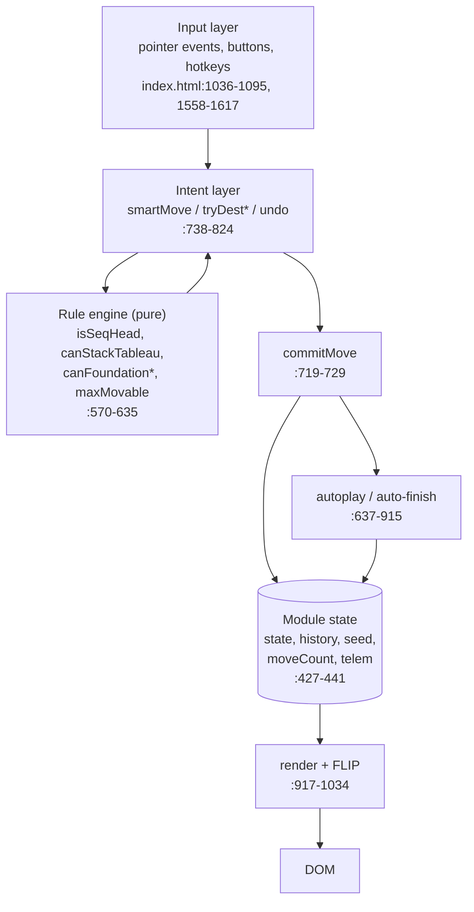
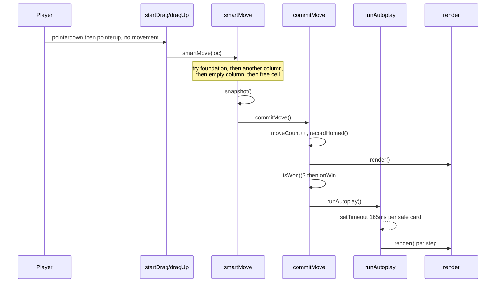
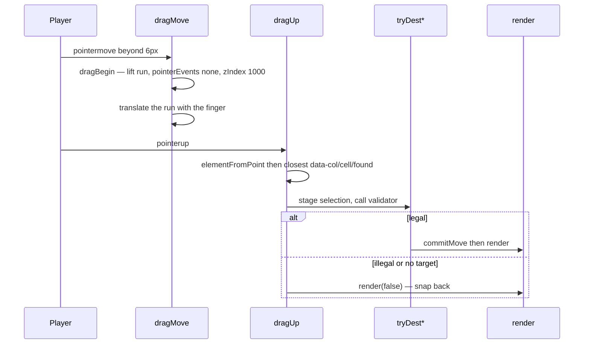
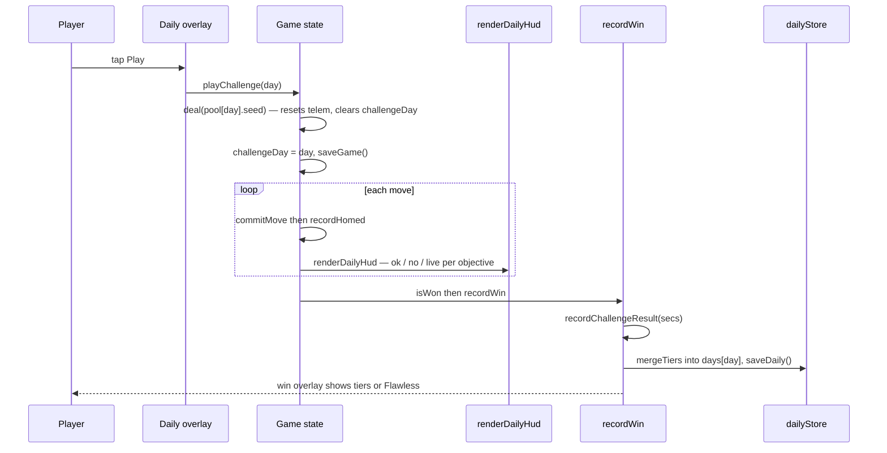
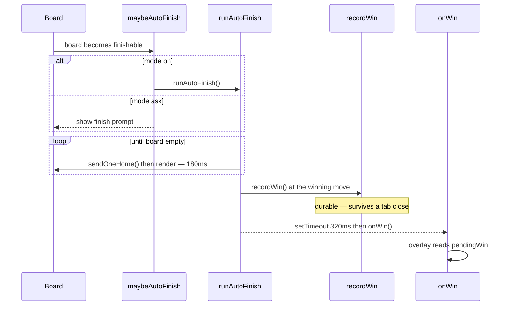
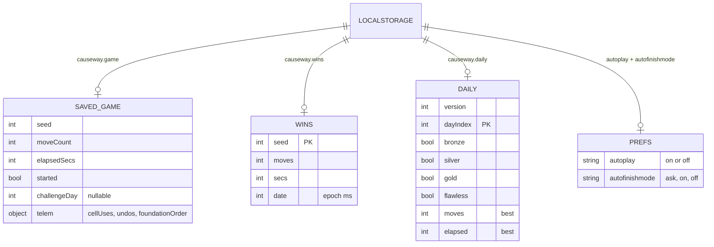

# Causeway — Web Prototype Architecture

The web build is **one file**: [`index.html`](../../index.html), 1 627 lines, comprising a `<style>`
block (lines 7–250), inline SVG background art (253–290), static DOM (291–406), and a single
`<script>` (408–1625). It has no build step, no bundler, no framework and no dependencies. It runs
from `file://`.

Everything below is verified against source; inferences about rationale are marked **(inference)**.

---

## 1. Top-level architecture

There are no modules and no classes. The script is organised as **labelled sections over shared
module-scope mutable state**, with one-way flow from user input → rules → state mutation → full
re-render.



**The central invariant:** every legal move funnels through `commitMove()` (`:719-729`), which is the
single place that increments `moveCount`, records telemetry, starts the clock, re-renders, checks
for a win, persists, and schedules automation. The only deliberate bypass is the "Show me how to
win" demo, which mutates the board directly precisely so that nothing is scored (`:1236-1247`).

### Rendering model

`render()` (`:977-1034`) **destroys and rebuilds** the free cells, foundations and tableau on every
call (`innerHTML = ""`, then re-create every card element). Continuity of motion comes from a FLIP
pass, not from DOM identity:

1. `captureRects()` (`:953-957`) records every `.card[data-id]` bounding box before the rebuild.
2. After rebuild, `flip(prev)` (`:958-975`) computes each card's delta, applies an instant inverse
   `transform`, raises `zIndex` to 900, then on the next animation frame transitions the transform
   away over 140 ms and restores the stacking order at 170 ms.

**(inference)** Full-rebuild-plus-FLIP was chosen because it keeps state→DOM mapping trivial — there
is no diffing or reconciliation anywhere — at the cost of re-creating ~52 elements per move. At this
scale that is invisible, and the approach is why `render()` can be called liberally from a dozen
places.

---

## 2. Module inventory

"Modules" here are the source sections; each row gives its line range so you can jump straight in.

### 2.1 Constants and RNG — `index.html:411-424`

- `SUITS = ["♠","♥","♦","♣"]`, `RED = Set([1,2])`, `RANKS` (index 0 is `""`), `NCELLS = 3`, `NCOLS = 8`.
- `mulberry32(a)` (`:419-424`) — the deterministic PRNG. This exact body is drift-pinned in
  `tests/engine.test.mjs` and re-implemented in Swift. It serves double duty: deal shuffling and the
  per-day challenge RNG.

### 2.2 Mutable state — `index.html:427-441`

```js
let state, history, seed, moveCount, startTime, timerId, selection;
let telem = { cellUses:0, undos:0, foundationOrder:[] }, challengeDay = null;
```

`state` is `{tableau: Card[8][], cells: (Card|null)[3], up: int[4], down: int[4]}` (`:485-490`).
`selection` survives only as a **transient staging variable** for drag-drop: `dragUp()` assigns it,
calls the `tryDest*` validators, and clears it immediately (`:1083-1087`). There is no persistent
tap-to-select model any more — that was removed at `bfb64c8` ("remove dead selection code").

**Storage safety wrapper.** `lsGet`/`lsSet`/`lsRemove` (`:430-431`, `:508`) swallow every
`localStorage` exception, because sandboxed and `file://` webviews throw on access. This is why the
game still runs with storage entirely unavailable.

### 2.3 Rule engine (pure) — `index.html:570-635`

| Function | Line | Contract |
|---|---|---|
| `isSeqHead(col, idx)` | 572 | cards `idx..end` form an alternating-colour run monotonic by 1, ascending **or** descending. Bounds-guarded (a tap can carry an index invalidated by an auto-play in the intervening timer gap) |
| `runDir(cards)` | 593 | `"single" \| "desc" \| "asc"` |
| `tailDir(col)` | 599 | direction already established by a column's bottom two cards |
| `canStackTableau(cards, col)` | 607 | the non-obvious rule — see below |
| `maxMovable(targetEmpty)` | 622 | `(freeCells+1) * 2^max(0, emptyCols - (targetEmpty?1:0))` |
| `canFoundationUp/Down(card)` | 626/630 | `rank === up[s]+1 && rank < down[s]` / `rank === down[s]-1 && rank > up[s]` — the "never cross" rule lives in the second clause |
| `isWon()` | 635 | every suit has `down === up + 1` |

`canStackTableau` encodes what makes Causeway not FreeCell: the head must be opposite-colour and one
rank away; `conn` is the direction of the join; a multi-card run must continue *its own* direction;
and the destination's established direction may not be reversed (`:613-617`).

### 2.4 Safe auto-play — `index.html:637-687`

`isSafeAutoplay(card)` (`:645-649`) is deliberately stricter than FreeCell's. Because Causeway's
tableau builds in **both** directions, an opposite-colour `rank-1` *or* `rank+1` card could still
need this card as a base, so a card is only safe once *both* neighbours are resolved for *both*
opposite-colour suits. Six counterexamples are pinned at `tests/engine.test.mjs:66-105`.

`runAutoplay()` (`:673-687`) drives a self-terminating `setTimeout` chain at 165 ms per step, gated
on `!startTime` so nothing moves before the player's first move.

### 2.5 History and mutation — `index.html:689-729`

`snapshot()` (`:690-701`) pushes a deep copy of board state **plus two telemetry cursors**
(`foundationOrder.length` and `cellUses`), capped at 500 entries. `undo()` (`:702-718`) restores the
board and *truncates* `foundationOrder` back to its cursor — so exploring with undo cannot pollute
the ordering objectives. `telem.undos` is deliberately **not** rolled back (`:713`): an undo happened,
and `no-undo` must fail permanently.

### 2.6 Auto-finish — `index.html:826-915`

Three cooperating pieces:

- `autoFinishWouldWin()` (`:878-901`) — pure simulation on copies: greedily cascade every available
  card home until fixpoint, then check every suit closed.
- `sendOneHome()` (`:828-842`) — the executor, one card per call, cells first then tableau tops.
- `runAutoFinish()` (`:847-873`) — the animation chain at 180 ms per card.

The detector and the executor use the *same greedy rule*, so they can never disagree — an invariant
tested directly by replaying the executor to fixpoint and comparing against the detector
(`tests/engine.test.mjs:216-228`). Mode is `ask` (default) / `on` / `off` (`:436`).

### 2.7 Win recording — `index.html:1103-1140`

Split deliberately in two:

- `recordWin()` (`:1108-1122`) — **durable** side effects, guarded by `winRecorded` so it runs exactly
  once. Stops the clock, clears the saved game, folds the best moves/time into `wins`, scores the
  daily attempt, and stashes display data in `pendingWin`.
- `onWin()` (`:1123-1139`) — **presentation** only.

The split exists because auto-finish defers the overlay by 320 ms so the last card can land
(`:863-865`); recording durably at the winning move means a tab close during that beat cannot lose
the win. `pendingWin` is needed because `wins[seed]` has already been overwritten by then.

### 2.8 Daily Challenges — `index.html:1142-1471`

An inlined copy of the canonical `tests/daily.mjs`, drift-guarded at `tests/daily.test.mjs:236-258`.
Contains: the civil-calendar helpers and epoch (`:1145-1148`), the six ordering checkers
(`:1149-1154`), the `OBJECTIVES` table (`:1155-1167`), the frozen objective pools (`:1168-1169`), the
generator (`:1171-1180`), grading/merge/streaks (`:1181-1207`), the pool/solutions fetch
(`:1210-1219`), challenge play and scoring (`:1222-1228`, `:1338-1346`), the demo engine
(`:1230-1336`), and rendering (`:1348-1471`).

Two functions here exist **only** on the client and have no canonical counterpart:

- `objViolated(obj, t)` (`:1421-1437`) — fail-fast "already impossible" for the live HUD.
- `objSecured(obj, up, down, t)` (`:1441-1452`) — "already locked in", so the HUD can show a green ✓
  the moment a Gold is guaranteed by any completion.

`objSecured`'s `suit-sprint` case requires **≥3 suits finished**, not one — with only one suit left
no interleaving violation remains possible (`:1449`). That subtlety was a live bug fixed at `f96c06b`.

### 2.9 "Show me how to win" demo — `index.html:1230-1336`

A small state machine over `demoing` / `demoPaused` / `demoStarted` (`:1234`). It opens **ready but
not running** — paused with no timer — so the line never auto-plays (`:1329-1331`). `applyDemoToken`
(`:1236-1247`) applies one compact solver token straight to the board, bypassing `commitMove`
entirely so nothing is scored.

`deal()` is the single demo-teardown chokepoint (`:469-476`): every path that lays out a fresh board
calls `stopDemo()` first. The comment documents why — a queued `setTimeout(step)` firing against a
new board would pop from an empty column, leaving `demoing` stuck true and input locked forever.

### 2.10 Wins UI — `index.html:1473-1542`

`wonRanges()` (`:1474-1483`) compresses solved seeds into contiguous `[a,b]` ranges; `openWins()`
renders them as chips and `openWinsDetail(a,b)` drills into individual deals.

### 2.11 Persistence — `index.html:507-568`

| Key | Written by | Shape |
|---|---|---|
| `causeway.game` | `saveGame()` `:509` | board + `moveCount`, `elapsedSecs`, `started`, `challengeDay`, `telem` |
| `causeway.wins` | `saveWins()` `:458` | `{ [seed]: {moves, secs, date} }` |
| `causeway.daily` | `saveDaily()` `:1213` | `{version: 1, days: { [dayIndex]: TierResult }}` |
| `causeway.autoplay` | `:1600` | `"on"` / `"off"` |
| `causeway.autofinishmode` | `:1581` | `"ask"` / `"on"` / `"off"` |

`restoreGame()` (`:521-568`) is unusually defensive: it checks array shapes, then per suit
`0 ≤ up ≤ 13`, `1 ≤ down ≤ 14`, `up < down`, then reconstructs all 52 canonical card ids — those on
the board **plus** those implied home by the foundation ranks — and requires each to appear exactly
once. A completed board is refused too, since it is not a resumable game.

---

## 3. Key flows

### 3.1 Tap to smart-move, with the auto-play cascade



The tap/drag split is decided by distance: `dragMove` requires 6 px of travel before it becomes a
drag (`:1066`); a `pointerup` with `started === false` is treated as a tap (`:1078`).

### 3.2 Drag to place exactly



`pointer-events: none` on the dragged run (`:1061`) is what lets `elementFromPoint` see the drop
target *underneath* the floating cards.

### 3.3 Playing a daily challenge end to end



Note the ordering: `deal()` clears `challengeDay`, so `playChallenge` must set it *after*
(`:1225-1226`). The same pattern appears in `restartDeal()` (`:1568-1573`), which re-deals then
re-applies the day so a replay still scores as that challenge.

### 3.4 Auto-finish with the deferred win overlay



---

## 4. Persisted data model



---

## 5. State of the architecture — web prototype

### Design decisions and their apparent rationale

| Decision | Evidence | Rationale |
|---|---|---|
| Single self-contained file, no build | `package.json` description; `index.html` has zero imports | Must run from `file://`; documented at `tests/engine.mjs:3-7` as the reason logic is duplicated rather than imported |
| Full re-render + FLIP instead of diffing | `:977-1034`, `:958-975` | **(inference)** trivial state→DOM mapping at 52-element scale |
| Every move through `commitMove` | `:719-729` | one place owns move counting, telemetry, win check, persistence, automation |
| Durable win recording split from overlay | `:1108-1122` vs `:1123-1139` | added at `7f45ea5` after a review found a kill-during-beat could lose the win |
| `deal()` as demo-teardown chokepoint | `:469-476` | added at `67f6fa0`; the comment records the exact input-lock bug it prevents |
| Telemetry by diffing foundations | `recordHomed` `:446-453` | explicitly "non-invasive — leaves the drift-guarded send functions untouched" |
| Storage access wrapped in try/catch | `:430-431` | sandboxed/`file://` webviews throw |

### Tight coupling and accumulated debt

1. **Everything is module-global.** `state`, `seed`, `history`, `telem`, `challengeDay`, `demoing`,
   `dailyStore` are free variables shared across **113** top-level functions, any of which may read
   or write them. There are no seams, so the web build is untestable in place — which is *why*
   `tests/engine.mjs` and `tests/daily.mjs` exist as re-typed copies. The duplication is a symptom of
   this coupling, not an independent choice.
2. **DOM ids as the integration layer.** Functions reach for `document.getElementById(...)` inline
   throughout — **73** call sites. Renaming any id in the static DOM silently breaks behaviour with
   no compile-time signal.
3. **`onclick` attributes built by string concatenation.** `renderDailyCard`/`renderDailyCal` emit
   `onclick="playChallenge(${day})"` and `showSolution(${c.seed},'${tier}','${esc(label)}')`
   (`:1379-1391`, `:1415`). Objective labels are escaped by a hand-rolled `esc()` that handles only
   quotes. The inputs are baked, developer-authored strings so this is not a live injection risk,
   but it couples rendering to global function names and is fragile.
4. **Three timer systems with overlapping ownership.** `autoTimer`, `finishTimer` and `demoTimer` are
   independent module-scope handles, each with its own stop function, and several code paths must
   remember to call more than one (e.g. `undo()` stops autoplay *and* finish *and* the prompt,
   `:703-704`). The iOS port replaced this with monotonic generation tokens; the web build did not.
5. **The live-HUD checkers are an unguarded fourth copy of the objective semantics.**
   `objViolated`/`objSecured` (`:1421-1452`) restate every checker's violation branch with no test
   and no drift guard. `f96c06b` fixed a real false-positive here (`suit-sprint` reported "on track"
   with one suit home when three are required) — exactly the class of bug the guards exist to catch,
   in the one place they do not reach.
6. **Known live bugs, tracked but open.** Backlog **L2**: the global `keydown` handler (`:1614-1617`)
   has no focus or overlay guard, so pressing `n` while typing in the deal-number field discards the
   game, and Cmd+Z undoes beneath the win overlay. Backlog **L5**: `recordWin` takes
   `min(moves)` and `min(secs)` independently (`:1115-1117`), so a stored "best" can describe a
   playthrough that never happened.

### Inconsistencies with the iOS app

| Area | Web | iOS |
|---|---|---|
| Elapsed time | wall-clock: `Date.now() - startTime` (`:1100`) | tick-count: `elapsed += 1` per timer fire | 
| Daily availability | needs a served origin; `file://` leaves Daily disabled (`:1214-1215`) | always available from the bundle |
| Landscape | none — only a `max-width: 560px` breakpoint (`:183-188`) | dedicated three-column layout |
| Stats backup | absent | export/import to a JSON file |
| Async cancellation | three ad-hoc timer handles | generation tokens (`finishGen`, `demoGen`) |
| `dailyChallenge` signature | takes the seeds **array** (`:1171-1173`) | takes the pool (Swift `[PoolSeed]`) |

The time-source divergence is tracked as backlog **L4** and is user-visible: backgrounding the
browser tab keeps counting, while the iOS timer does not.

### Vestigial code (verified)

- **`.card.hintsrc`** (`:118`) — a CSS rule with a blue focus ring. `grep` finds the class name
  nowhere in the script; no code ever applies it. Left over from the removed tap-to-select model.
- **`selection` as a persistent concept** — reduced to a two-line staging variable inside `dragUp`
  (`:1083-1087`). The `tryDest*` validators still read it as though a selection model existed, which
  is why `drop` on iOS has the same "stage then clear" shape.
- **`RANKS[0] = ""`** (`:414`) — a placeholder so the array can be indexed by 1-based rank.
  Harmless, but it means `RANKS` has 14 entries for 13 ranks.
- The baked pool ships `winnable`, `minSeed` and `constraintPar` fields that **no runtime code
  reads** — `grep` for them in `index.html` returns nothing. They are build-time provenance carried
  into the shipped asset (the same is true on iOS, whose `PoolSeed` decodes only `seed`, `par`,
  `supports`).
